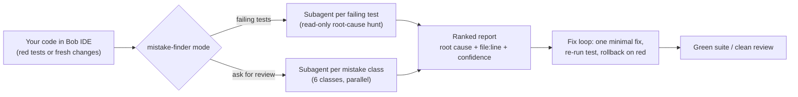

# Mistake Finder — an IBM Bob skill that finds your mistakes

> **Theme:** Build with purpose using IBM Bob 2.0 (IBM Bob 2.0 Hackathon, lablab.ai)
> **What it is:** A portable Bob **skill** — no example code, no sample app.
> You write your own code in Bob; this skill finds your mistakes.

## Problem

Two moments burn developer time:

1. **A red test suite.** Failures get diagnosed serially — read failure #1,
   grep, hypothesize; move to failure #2 in a different module with fresh
   context. Time scales with the *sum* of all failures, and recall depends on
   how tired you are.
2. **Code you just wrote.** Mistakes ship because review is manual,
   inconsistent, and skipped under deadline pressure.

## Solution

`mistake-finder` is a Bob skill that fans out **parallel subagents** — one per
failing test, or one per mistake class — each in its own isolated context
window, and returns only compact, evidence-backed summaries. The main agent
aggregates a ranked report and (for failing tests) applies one minimal fix at a
time with **rollback** on any fix that misses.

- **Mode 1 — Failure triage:** tests red → one read-only subagent per failing
  test traces the failure to a root cause (`file:line` + confidence), the main
  agent fixes with rollback until the suite is green.
- **Mode 2 — Proactive review:** ask *"check my code for mistakes"* → one
  read-only subagent per mistake class (logic & boundaries, error handling,
  concurrency, resources, security, test gaps) hunts your uncommitted changes.

Diagnosis time scales with the *slowest* failure, not the sum — and every
finding carries evidence or it isn't reported.



## What's in this repo

```
.bob/skills/mistake-finder/
├── SKILL.md               the skill — workflow for both modes
├── review-checklist.md    the mistake classes Mode 2 hunts for
├── report-template.md     exact report formats for both modes
├── box.py                 core: error parser, suggestion engine, box renderer
├── mistake_box.py         CLI: run code in the terminal, get a boxed report
├── pytest_plugin.py       pytest plugin: box every failing test automatically
├── __init__.py            makes the folder importable/installable as a package
└── (the package *is* the folder — see pyproject.toml)
pyproject.toml             packaging: `mistake-box` CLI + pytest plugin
install_skill.py           one-command global install into IBM Bob
bob_sessions/              required Bob task-session screenshots (submission)
find_mistakes.py           universal runner — auto-detects active file
find-mistakes.bat          one-command launcher (Windows)
smart_run.py               smart library detector for run.bat
tests/                     15 individual *.test.py demo files (one per library)
demos/                     14 runnable demo files showing WRONG vs CORRECT
.vscode/tasks.json         VS Code task: Ctrl+Shift+P → Run Task → find-mistakes
```

## Install as an extension (any editor / IDE)

`pip install` turns this repo into an installable extension, not just a skill:

```bash
pip install .            # or: pip install -e .   for a live checkout
```

That registers two things in the Python environment you install into:

- **A pytest plugin.** From then on, every `pytest` run ends with a boxed report
  for each failing test — no wrapper, no config, no per-project setup. Install
  once and it works in the terminal, CI, and any IDE that runs pytest with that
  interpreter (VS Code's Testing panel, PyCharm's run gutter, ...).
- **A `mistake-box` command** — the wrapper from step 3b, now on your PATH:

  ```bash
  mistake-box python mycode.py
  mistake-box --file mycode.py
  mistake-box --log ci.log
  ```

Turn the plugin off for one run with `--no-mistake-box`, or globally by setting
`MISTAKE_BOX=0`.

```
╔════════════════════════════════════════════════════════════════╗
║ MISTAKE FOUND - AssertionError                                 ║
╠════════════════════════════════════════════════════════════════╣
║ TEST                                                           ║
║   tests/test_calc.py::test_add                                 ║
╠════════════════════════════════════════════════════════════════╣
║ WHERE                                                          ║
║   tests/test_calc.py:5                                         ║
║      4 | def test_add():                                       ║
║ >>   5 |     assert add(2, 3) == 5                             ║
╠════════════════════════════════════════════════════════════════╣
║ WHAT WENT WRONG                                                ║
║   AssertionError: assert -1 == 5 | +  where -1 = add(2, 3)     ║
╠════════════════════════════════════════════════════════════════╣
║ SUGGESTIONS                                                    ║
║   1. Read the assertion: what value did the code actually      ║
║   produce, and what did the test expect? ...                   ║
╚════════════════════════════════════════════════════════════════╝
```

> Point the IDE at the interpreter you installed into (VS Code: **Python:
> Select Interpreter**; PyCharm: project interpreter). If an IDE runs tests in
> its own throwaway environment, run `pip install .` inside *that* environment.

## Install and run in IBM Bob (step by step)

### 1. Load the skill

Two options:

- **This repo only (project-scoped):** nothing to do. Bob picks up skills from
  `<project>/.bob/skills/` automatically when you open this project.
- **Every project (global):** from this repo's root, run

  ```bash
  python install_skill.py
  ```

  That copies the skill to `~/.bob/skills/mistake-finder/`. Check it worked:

  ```bash
  python install_skill.py --check    # status only
  python install_skill.py --remove   # uninstall the global copy
  ```

### 2. Verify Bob sees it

1. Open Bob IDE (this project, or any project if you installed globally).
2. Open **Settings → Skills** and confirm `mistake-finder` is listed, with its
   location shown (project or `~/.bob/skills`).
3. Optional, for hands-free activation: **Settings → Auto-Approve → Skills**
   ON. Otherwise Bob asks once before activating the skill — that's fine too.

If it is not listed: restart Bob, and re-check that `SKILL.md` sits directly
inside the `mistake-finder/` folder.

### 3. Use it

Open a conversation in Bob **Agent mode**, then:

- Tests red? → *"Run mistake-finder on the failing tests."*
- Just wrote something? → *"Check my code for mistakes."* (reviews your
  uncommitted changes) or *"Check src/payments.py for mistakes."*
- CI log instead of a local run? → *"Run mistake-finder on artifacts/ci.log."*

Bob activates the skill from your description, fans out the subagents (watch
them appear in parallel in the Tasks panel), then produces the ranked report.
For triage mode it applies one fix at a time, re-runs the affected test, and
rolls back anything that doesn't turn green.

### 3b. Boxed errors straight in your terminal

Bob reports inside the IDE. When you are running code in a plain terminal and
want the same treatment — the mistake located and explained in one box instead
of a bare traceback — wrap the command with the bundled script:

```bash
python .bob/skills/mistake-finder/mistake_box.py python mycode.py
python .bob/skills/mistake-finder/mistake_box.py --file mycode.py   # syntax check only
python .bob/skills/mistake-finder/mistake_box.py --log ci.log       # parse a saved traceback
```

Your program's normal stdout passes straight through; the error becomes a
single box with **WHERE** (file:line, the offending source line, a caret),
**WHAT WENT WRONG** (exception + message), and **SUGGESTIONS** (concrete
fixes). It is dependency-free Python 3.8+, tailors the advice to the exception
(SyntaxError, NameError, TypeError, IndexError, KeyError, ZeroDivisionError,
import errors, ...), falls back to a plain `+-|` box when the terminal cannot
render the fancy one, and exits with your program's exit code so it drops into
scripts and CI.

```
╔══════════════════════════════════════════════════════════════╗
║ MISTAKE FOUND - SyntaxError                                  ║
╠══════════════════════════════════════════════════════════════╣
║ WHERE                                                        ║
║   mycode.py:12                                               ║
║ >>  12 |     if x = 5:                                       ║
║               ^                                              ║
╠══════════════════════════════════════════════════════════════╣
║ WHAT WENT WRONG                                              ║
║   SyntaxError: invalid syntax. Maybe you meant '==' or ':='? ║
╠══════════════════════════════════════════════════════════════╣
║ SUGGESTIONS                                                  ║
║   1. A single `=` assigns; use `==` to compare.              ║
╚══════════════════════════════════════════════════════════════╝
```

### 3c. Voice mode — say it out loud

The same boxed report, driven by speech. Say *"find the mistake in demo math"*
(by microphone or typed) and it works out which file you meant, runs it, prints
the box, and reads the result back to you:

```bash
voice.bat                     # push-to-talk loop: press Enter, speak, Enter
voice.bat --text "find the mistake in demo json"   # no mic needed
voice.bat --file mycode.py    # analyse one file now
voice.bat --list-mics         # pick a microphone
```

It recognises the file from what you say ("demo underscore math" →
`demos/demo_math.py`), falls back to the file you pinned or edited most
recently, and answers non-find questions with Granite on watsonx.ai via the
Watson STT/TTS pair. No pip installs needed. Full details, credential setup and
troubleshooting: [`VOICE.md`](VOICE.md).

### 4. Capture the submission evidence

Screenshots in Bob's task-session summary are a required deliverable:

1. In Bob, open **Tasks**, select the task, open the session/consumption
   summary.
2. Screenshot as PNG, name it `<team>_taskNN_<short-description>.png`, save
   into [`bob_sessions/`](bob_sessions/README.md).

Expected shots: the parallel fan-out, the ranked report + fix loop, and the
final green verification. All screenshots must be committed before submission.

### 5. Budget

One skill definition + roughly 3–4 Agent runs per demo (triage run, review
run, optional verification run). Building the skill itself cost no Bobcoins.

## Why it's safe to let near your code

Guardrails are built into the skill instructions, not the model's goodwill:

- Investigating subagents are **read-only**.
- Tests are the spec: never weakened, skipped, deleted, or "fixed" to match
  buggy behavior.
- Every claim needs `file:line` evidence — no evidence, not a finding.
- One minimal fix at a time, one module per fix, full suite verified at the
  end, rollback on any fix that misses.
- In review mode, nothing is edited until you pick which findings to fix.

## Adapting it

- **Add mistake classes** (e.g. frontend-specific, API-contract, i18n): append
  a class section to `review-checklist.md` — the workflow picks it up
  unchanged.
- **Change report style:** edit `report-template.md`.
- **Team rollout:** commit `.bob/skills/` in your repo, or have teammates run
  `install_skill.py` once.

## Compliance note

No external datasets, no company data, no personal information, no third-party
code. The skill is original markdown instruction sets; the installer is
original Python with no dependencies.
